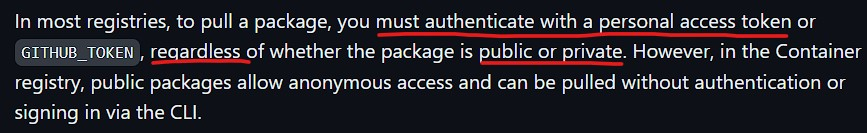

# Unity Patterns


**Unity version:** `2021.3.7f1`

Unity Design Patterns implementations, to shared across projects as an [UPM](https://docs.unity3d.com/Manual/cus-layout.html) package. Below you can see which patterns are implemented until here

## Installation

Install the [OpenUPM](https://openupm.com) CLI and add the [com.mfdeveloper.unitypatterns](https://openupm.com/packages/com.mfdeveloper.unitypatterns) package

```bash

# Install node (e.g using NVM)
curl -o- https://raw.githubusercontent.com/nvm-sh/nvm/v0.39.5/install.sh | bash
# "node" is an alias for the latest version
nvm install node
# You can list available versions using "ls-remote"
nvm ls-remote
# or 16.3.0, 12.22.1, etc
nvm install 14.7.0

# Install openupm-cli
npm install -g openupm-cli

# Go to your Unity project directory
cd YOUR_UNITY_PROJECT_DIR

# Install package: com.mfdeveloper.unitypatterns
openupm add com.mfdeveloper.unitypatterns

```

### OpenUPM package

Follow the installation guide from: [openupm/com.mfdeveloper.unitypatterns](https://openupm.com/packages/com.mfdeveloper.unitypatterns)

Alternatively, merge the snippet below to [Packages/manifest.json](https://docs.unity3d.com/Manual/upm-manifestPrj.html) manually

```jsonc
{
    // Verifiy which is the latest tag in this repository
    "dependencies": {
        "com.mfdeveloper.unitypatterns": "<LATEST_VERSION>"
    },
    // If you already have the openupm registry,
    // only add this package to "scopes" array
    "scopedRegistries": [
        {
            "name": "package.openupm.com",
            "url": "https://package.openupm.com",
            "scopes": [
                "com.mfdeveloper.unitypatterns"
            ]
        }
    ]
}
```

## Github package

1. Generate an **access token** on your Github account, following the guide: [Creating a personal access token (classic)](https://docs.github.com/en/authentication/keeping-your-account-and-data-secure/managing-your-personal-access-tokens#creating-a-personal-access-token-classic).

2. Add a **`$HOME/.upmconfig.toml`** file with the TOKEN to authenticate on registry

    ```toml
    [npmAuth."https://npm.pkg.github.com/@mfdeveloper"]
    # Generate the token from your github profile:
    # https://github.com/settings/tokens
    _authToken = "<TOKEN-VALUE>"
    email = "<YOUR_EMAIL>"
    alwaysAuth = true
    ```

    > **WARNING:** _GitHub/Gitlab_ Packages registry always requires authentication. For **_private_** and **_public_** packages. If you don't have a Github account, or won't create a TOKEN, try use the [openupm](#openupm-package) package above.

    

3. Configure the scope **registry** and **dependency** in your Unity project `Packages/manifest.json`

    ```jsonc
    {
        "dependencies": {
            // Verifiy which is the latest tag in this repository
            "com.mfdeveloper.unitypatterns": "<LATEST_VERSION>"
        },
        "scopedRegistries": [
            {
                "name": "Github Packages: mfdeveloper",
                "url": "https://npm.pkg.github.com/@mfdeveloper",
                "scopes": [
                    "com.mfdeveloper.unitypatterns"
                ]
            }
        ]
    }
    ```

## Git dependency

The minimal checked Unity Version is **`2019.3.*`** LTS

Open Package Manager and "Add package from git url..." using next string:

- `https://github.com/mfdeveloper/UnityPatterns.git#upm`

Or use the latest git release/tag:

- `https://github.com/mfdeveloper/UnityPatterns.git#<LATEST_VERSION>`

You also can edit `Packages/manifest.json` manually, just add:

```json
{
  "dependencies": {
    "com.mfdeveloper.unitypatterns": "https://github.com/mfdeveloper/UnityPatterns.gitt#<LATEST_VERSION>"
    }
}

```

## Local dependency (Embedded package)

1. Download or clone this repo from `[upm]` branch

    ```bash

    git clone -b upm https://github.com/<repo_url>.git
    
    ```

2. Copy the content of root folder into your project's `Packages/<PACKAGE_NAME>` folder.

## Unity: Singleton

Unity Singleton Monobehaviour component, that can be attached to Game Objects. You can use `SingletonPersistent` to persist the instance among scenes
or just `Singleton` class to use the same instance on the only one scene.

### Main use cases

- Managers that should use the same instance among scripts (e.g GameManager, ScoreManager, InputManager...)

- When you need use any component that depends of a Game object in the scene (e.g access `AudioSource` inside of an singleton)

- When you need a Singleton with Unity messages like `Start()`, and/or access some objects that are only available after the game starts
  > (e.g Audio Middlewares, Third Party packages/libraries...)

> Consider use a [ScriptableObject](https://docs.unity3d.com/Manual/class-ScriptableObject.html) instead

### Getting started

Create a script that inherits from `Singleton<MyScript>` passing the script class by generics:

```csharp
public class GameManager : Singleton<GameManager> {
  ...
}
```

In any other script, access the `Instance` property. The value of this property should be equal from any script:

```csharp
public class PlayerController : Monobehaviour {
  
  private void Awake() {
      // Get the singleton instance
      var gameManager = GameManager.Instance;
  }
}
```

### Persistent Singleton

If you wish a singleton that persists among scenes, you can create a class that inherit from `SingletonPersistent`:

```csharp
public class GameManager : SingletonPersistent<GameManager> {
  ...
}
```

## Unity: Factory Method

A base Factory Method implementation for Unity. The main use case here is to use this to access a gameObject in the scene that contains a script that implements an `C#` interface:

```csharp

// Create a C# interface
public interface IMyComponent
{

}

// Create a MonoBehaviour script that implements the interface above, and attach it to a gameObject in the scene
public class MyScript : MonoBehaviour, IMyComponent
{

}

// Example to access the a gameObject script that implements an interface
using System.Linq;
using UnityEngine;
using UnityPatterns;

public class ExampleScript : MonoBehaviour
{
    public GameObject[] rootsFromDontDestroyOnLoad;
    void Start()
    {
        IMyComponent myComponent = FactoryComponent.Get<IMyComponent>();

        // (Optional) You can get the all gameObjects with a script that implements an interface
        List<IMyComponent> myComponent = FactoryComponent.GetList<IMyComponent>();

        Debug.Log($"The component is: {myComponent.GetType().Name}") // Prints: MyScript
    }
}
```

### Main use cases

- Get singleton managers from all scenes active scenes (including `DontDestroyOnLoad` automatic scene created by Unity).

- Get any **gameObject** from scenes that contains a script that implements an `C#` interface.

## Code templates

Under `Samples~` folder, this package share some code templates to easily create singleton classes from Unity Editor.

To use that, follow the steps below:

1. On Unity Editor, click on `Window` => `Package Manager`
2. On the opened window, find the package `Unity Design Patterns...` and import the sample: **ScriptTemplates**
3. Move the imported folder `ScriptTemplates` to your root `Assets` folder in your Unity game project.
4. Restart the Editor
5. Openup again, and press right click on any folder of your game project, and check if appears: `Create` => `Custom Templates` => `UnitySingleton` :)

## References

- [mstevenson/MonoBehaviourSingleton.cs](https://gist.github.com/mstevenson/4325117)

> The implementation here was based in this gist above!!

- [Design Pattern: Singletons in Unity](https://www.youtube.com/watch?v=Ova7l0UB26U)
